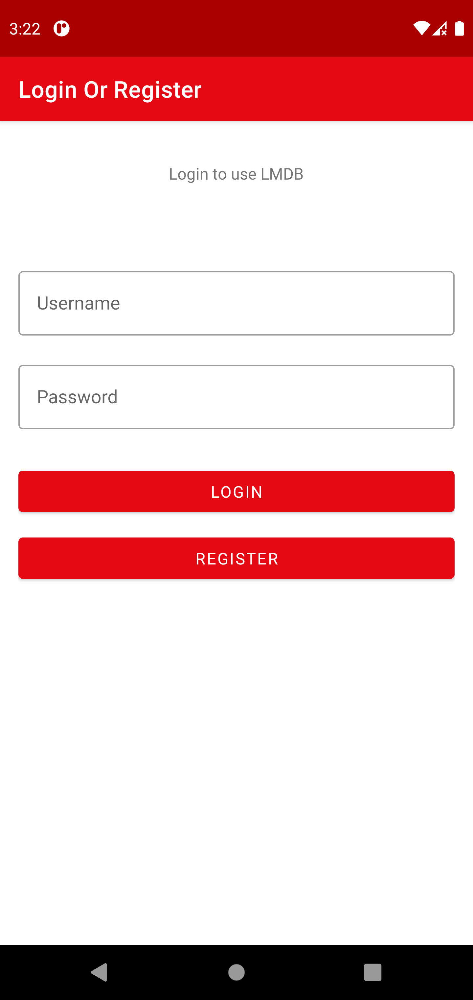
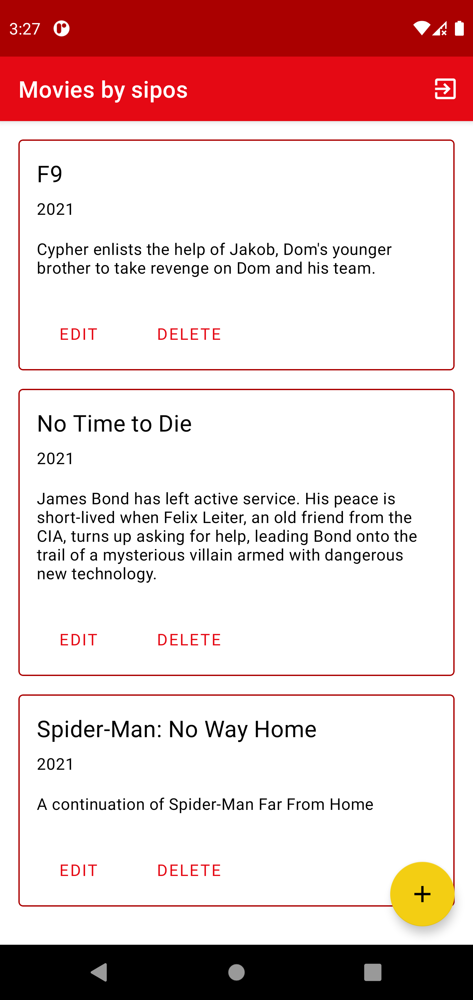
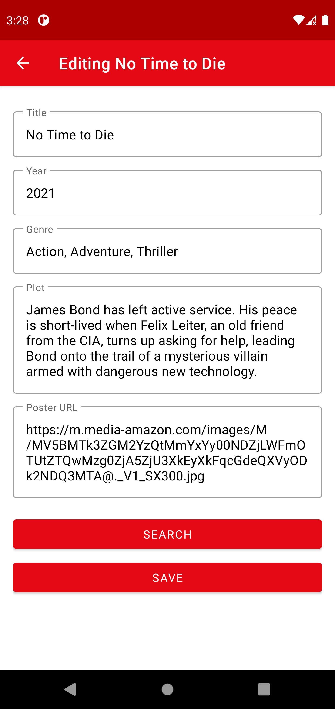

# LMDB (Local Movie DataBase)

This app is basically a simple, IMDB copy.  
It lets you to add and store data of movies such as: title, year, genre, plot and cover image (as url). 

## About

The app uses room for local database storage and retrofit2 for network requests.  
It requires you to register, so you can have multiple, separated list on you phone.  
Retrofit2 is used to call api data, so you don't need to fill out every detail for a movie.

### Login screen

### Movie list screen

### Add new / edit movie screen

### View movie in detail

